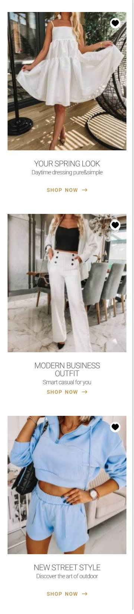

Recruitment task

# Links:

- Live Site URL: [https://joannalapa.github.io/Products-listing/](https://joannalapa.github.io/Products-listing/)

This is a solution for recruitment task based on provided instructions and mockup.

# Table of contents

- [Overview & assumptions](#overview--assumptions)
- [Screenshots](#screenshots)
- [My process](#my-process)
    - [Built with](#built-with)
    - [Useful resources used during the implementation](#useful-resources-used-during-the-implementation)
- [Author](#author)

## Overview & assumptions

Pictures were adopted for performance:

- the quality was limited to 70% with Photopea, saved as jpg and optimised with [squoosh.app](https://squoosh.app);

- icon was converted to svg for better performance and easier styling.

Icon dimansions and positioning: 

I assump that: 

- 20px width is for a heart and with background-color it is total 28px; 
- as an origin to move the heart icon I took the middle of it - from the top and the right corner of the picture to the middle of the heart is 30px.
- icon is only an icon as it was not provided in instructions any role for it. It looks like a button with aria-role "Add to favourite", normally I would ask about that and change the html structure with button tag.

I kept the provided font sizes for mobile design and changed to smaller for desktop design according to mockup look.

## Screenshots

## My process

### Built with

    Semantic HTML5 markup
    SCSS
    Flexbox
    Grid
    Mobile-first workflow

### Useful resources used during the implementation:

- [diffchecker.com](https://www.diffchecker.com/image-compare/)

- [photopea.com](https://www.photopea.com/)

- [developer.mozilla.org](https://developer.mozilla.org/en-US/)

- browser extensions: Pixel Perfect Pro, Measure-it and Color Picker

## Author

- Github - [@JoannaLapa](https://github.com/settings/profile)
