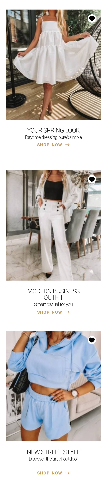
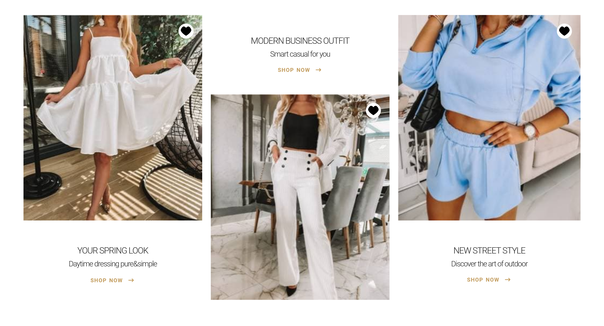

Recruitment task

# Links:

    #Live Site URL: https://joannalapa.github.io/Products-listing/

This is a solution for recruitment task based on provided instructions and mockup.

# Table of contents

    ##Overview & assumptions
    ##Screenshots
    ##My process
        ###Built with
    ##Author

## Overview

    Pictures were adopted for performance - the quality was limited to 70% with Photopea, saved as img and optimised with [squoosh.app](https://squoosh.app).

    Icon was converted to svg for better performance and easier styling.

    Icon dimansions and positioning:
     - I assumpt that the 20px witdh is for a heart and with background-color it is total 28px.
     - I assumpt that I move the middle of a heart icon from the top and right corner of the picture - as it was a part of SVG with background I moved top right corner of SVG with 16px.

## Screenshots

## My process

### Built with

    Semantic HTML5 markup
    SCSS
    Flexbox
    Mobile-first workflow

Useful resources that I used during the implementation:

    Pixel Perfect Pro, Measure-it and Color Picker extensions

    [diffchecker.com](https://www.diffchecker.com/image-compare/)

    [photopea.com](https://www.photopea.com/)

    [developer.mozilla.org](https://developer.mozilla.org/en-US/)

## Author

     Github - @JoannaLapa(https://github.com/settings/profile)
